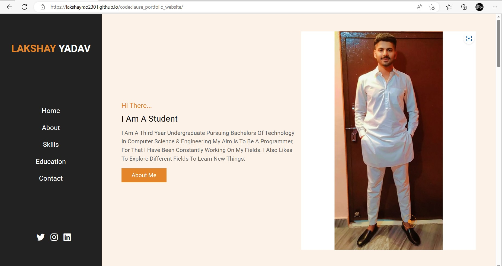

<!-- # codeclause_portfolio_website
I developed the portfolio website using html css javascript.

This was a website built to showcase my technical skills, web design skills.
 -->

# Portfolio Website
This repository contains the source code and assets for a portfolio website built using HTML, JavaScript, and CSS.

Link : https://lakshayrao2301.github.io/OIBSIP-Level-1-Task-2-Portfolio/

The website serves as a showcase for your work and provides information about your skills, projects, and contact details.

# Project timeline and technologies used
Build a Javascipt website in 10 Days to showcase the following:
* My technical skill set
* My web design skill set
* My projects

## Project Technologies Used
* HTML5
* CSS3
* JavaScript (ES6)
* Git
* GitHub
* VsCode

# Features
* Clean and modern design
* Responsive layout for various screen sizes
* About section to provide information about yourself
* Skills section to showcase your technical skills
* Projects section to highlight your past projects
* Contact section to provide contact information
* Smooth scrolling navigation
* CSS animations
* Fully customizable

# File Structure
|- codeclause-portfolio-website/

|- css/
    
    |- style.css

|- javascript/

    |- script.js

|- img/

    |- rao 2.jpeg
    |- rao 3.jpeg
    |- rao 4.jpeg
    |- rao 5.jpeg
    |- rao 6.jpeg
    |- About.jpg
    |- Contact.jpg
    |- Education.jpg
    |- Home.jpg
    |- rao.jpg
    |- Skills.jpg
    |- rao 2.jpeg
 
|- Html/

    |- index.html

* The css/ directory contains the CSS styles for the website.
* The js/ directory contains the JavaScript code for the website.
* The img/ directory stores the images used in the website.
* The root directory contains the HTML files for different sections of the website.

# Usuage
To use the portfolio website, you need to modify the HTML files to include your own content and customize the design as per your preference. Here's how you can do it:

1. Open the HTML files (index.html) in a text editor or IDE.

2. Update the content within the HTML tags to reflect your own information.

3. Customize the styles in the CSS file (css/style.css) to match your desired design.

4. Replace the images in the img/ directory with your own images.

5. Optionally, modify the JavaScript code in js/main.js to add any additional functionality.

Once you have made the necessary changes, you can preview the website locally by opening the HTML files in a web browser.

# Customization
The portfolio website is fully customizable to suit your preferences. Here are some areas you can consider customizing:

* Colors: Update the color scheme by modifying the CSS variables in css/style.css.
* Typography: Choose different fonts or adjust font sizes in the CSS file.
* Layout: Modify the HTML structure and CSS styles to change the layout of different sections.
* Images: Replace the default images in the img/ directory with your own images.
* Content: Update the text content within the HTML tags to reflect your own information.

Feel free to experiment and make the website your own!

# Deployment
To deploy your portfolio website, you have options:

* GitHub Pages: Push your code to a GitHub repository and enable GitHub Pages to host your website.

# Homepage visuals

